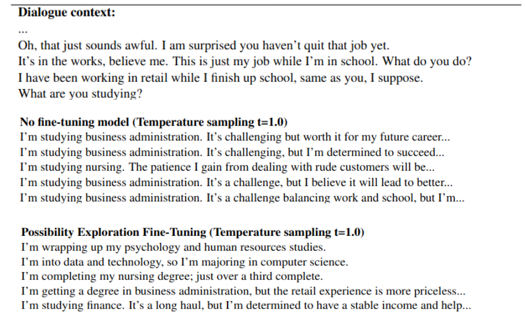

The repo is the official implementation for our paper: "Improving Linguistic Diversity of Large Language Models with Possibility Exploration Fine-Tuning", Arxiv[https://arxiv.org/abs/2412.03343]

### Challenge
Large language models (LLMs) are often fine-tuned using one-to-one mapping datasets where each input prompt is paired with a single response. During inference, these models generate outputs based on probability-based decoding techniques like beam search or temperature sampling. Consequently, **the responses produced by LLMs are typically predictable and conservative, prioritizing the most likely answers over more creative ones.**

### Problem Formulation
**Given a prompt P, the goal is to generate a list of candidate responses L that are semantically distinct from each other.** This approach is particularly important for applications like brainstorming tools, creative writing assistants, or any other task that requires multiple distinct responses to the same prompt.

Below is an example for dialogue generation task, we compare the set of responses generated by the Mistral model (without fine-tuning) and by the Mistral model fine-tuned with PEFT.



### Main Idea:
Instead of asking LLMs to provide just one response to a given task/prompt, **we encourage the model to think about multiple possible responses**. The model is then asked to generates a response corresponding to a specific "possibility number."

### Example for dialouge generation task:

Prompt:
```
Given the following dialogue context:
    Person B: "I have been working in retail while I finish up school, same as you, I suppose."
    Person A: "What are you studying?"

Imagine you are Person B, and act as if you were a real individual.
Consider all the different ways Person B might respond, and then provide the response that matches possibility number #k.
```
Expected Results:
```
    Response for possibility number 1: I'm wrapping up my psychology and human resources studies.
    Response for possibility number 2: I'm into data and technology, so I’m majoring in computer science.
    ...
```
The goal here is to modify the "possibility number k" within the prompt to guide the model toward a particular variation of the generated response.

### Proposed Approach:
We introduce Possibility Exploration Fine-Tuning (PEFT) to enhance the influence of the specified possibility number on the content of the generated response.

### Results:
Experiments using Mistral 7B and LLAMA 2 show that our method significantly increases the response diversity of the base model while achieving the best trade-off between diversity, coherence, and latency compared to other methods such as temperature sampling, diverse beam search, iterative prompting, and conditional variational framework.

### ----------------------------------------------------------------------------------------------------------------
## How to run the code?

### For training

```
#PEFT:
python train.py --train_file data/train_dialogs_1k.jsonl --loss_steps 100 --save_steps 500 --learning_rate 5e-5 --output_dir checkpoints --exp_name mistral_peft --per_device_train_batch_size 1 --gradient_accumulation_steps 2 --num_response_per_input 4 --max_num_negatives_per_sample 30 --ul_weight 0.5 --max_steps 1000 --max_length 500 --max_input_length 300 --model_name mistralai/Mistral-7B-Instruct-v0.2 --warmup_steps -1;

#OTMFT: (just adding --no_ul)
python train.py --train_file data/train_dialogs_1k.jsonl --loss_steps 100 --save_steps 500 --learning_rate 5e-5 --output_dir checkpoints --exp_name mistral_otm --per_device_train_batch_size 1 --gradient_accumulation_steps 2 --num_response_per_input 4 --max_num_negatives_per_sample 30 --ul_weight 0.5 --max_steps 1000 --max_length 500 --max_input_length 300 --model_name mistralai/Mistral-7B-Instruct-v0.2 --warmup_steps -1 --no_ul;

#OTOFT (changes train_dialogs_1k.jsonl --> train_dialogs_4k.jsonl ; change --num_response_per_input to 1; add --no_ul; --max_steps 4000)
python train.py --train_file data/train_dialogs_4k.jsonl --loss_steps 100 --save_steps 500 --learning_rate 5e-5 --output_dir checkpoints --exp_name mistral_oto --per_device_train_batch_size 1 --gradient_accumulation_steps 2 --num_response_per_input 1 --max_steps 4000 --max_length 500 --max_input_length 300 --model_name mistralai/Mistral-7B-Instruct-v0.2 --warmup_steps -1 --no_ul;
```

For LLAMA 2, change --model_name to meta-llama/Llama-2-7b-chat-hf

### For Inference

```
python infer.py --model_name_or_path checkpoints/mistral_peft/check_1000/ --num_response_per_input 5 --method peft --temperature 0.75 --decoding sampling --test_file data/test_dialogs.jsonl --save_file outs/out.jsonl

model_name_or_path: path to fine-tuned model or base model (e.g. mistralai/Mistral-7B-Instruct-v0.2)
Choices for method   = [peft, oto, otm, base]
Choices for decoding = [list, sampling, diverse]

for peft, otm --> use check_1000 (1 epoch); for oto --> use check_4000 (1 epoch)
```

### Coherence Evaluation
Make sure you have your OPENAI KEY and TOGETHER AI KEY, please open utils.py and put your keys in there.

```
python eval.py --eval_file outs/out.jsonl --save_file eval_logs/out.pkl
```
### Persona generation test

Please use PersonaGeneration.ipynb
